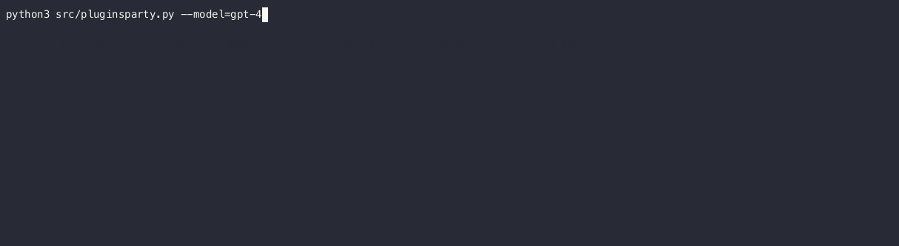

# 🎉 PluginsParty 🎈
## Bringing ChatGPT Plugins to All (LLMs and Humans)
## Join the Party! Now you can:

* Use plugins made for ChatGPT with other LLMs 🌐
* Enjoy ChatGPT with plugins today - no waitlist!*

*Don't get too excited! Available plugins are limited, but it wont last and what a catchy intro! 🎶

## The Goal

This project aims to provide **out-of-the-box support for ChatGPT plugins to other conversational LLMs**. It has been **tested to work with Vicuna, StableVicuna, GPT-3.5, and GPT-4 APIs**.

**Note:** This project does not involve Langchain or AutoGPT and adheres to the philosophy of plugin implementation by OpenAI.

The client is built to allow LLMs to invoke external plugins, extending LLM capabilities beyond language generation.

As of today, all models are accessed via the OpenAI client Python API.

This project was created to be a **multi-LLM plugin playground** and may also be valuable for **plugin testing automation**.

## Vicuna 13b - running locally on a 24GB GPU 


## GPT4 plugin enabled


## GPT3.5-turbo plugin enabled


## Features

- Interactive command-line interface for LLM conversations
- Markdown rendering for rich text responses
- support model-specific instructions and plugins-handling instructions
- Support for standard ChatGPT compatible plugins
- Support for multiple target language models (Vicuna, StableVicuna, GPT-3.5, GPT-4, etc.)
- Ability to execute code blocks provided by the assistant
- Support for streaming mode with the OpenAI API (where applicable)
- Generic or model-specific instruction support
- Bearer token authentication

## Installation

1. Clone the repository:
   ```
   git clone https://github.com/saturdaifever/pluginspartyi.git
   cd pluginparty
   ```

2. Install the required Python packages:
   ```
   pip install -r requirements.txt
   ```

3. Set the OpenAI API key as an environment variable:
   ```
   export OPENAI_API_KEY=your-api-key
   ```

## Usage

1. Run PluginParty:
   ```
   python3 src/pluginsparty.py
   ```

2. Enjoy!

3. To exit, type `exit` and press Enter.

## Plugin Integration

* Plugins listed in `plugins/default_plugins` are ***registered*** at the start.
* The model is instructed on how to use the plugin.

You can also register a plugin while conversing. Use the `/register` command followed by the plugin URL:
```
/register https://example.com/plugin.json
```

Once registered, the model will (eventually) invoke the plugin when needed.

## Program Invocation Options

You can customize the behavior of the program using command-line arguments:

- `--model`: Specify the language model to use (e.g., `gpt-3.5-turbo-0301`, `gpt-4`, `vicuna`, `stablevicuna-13b`). Defaults to `gpt-3.5-turbo-0301`.
- `--disable-streaming`: Disable streaming mode for the OpenAI API
- `--instruction-role`: Specify the instruction role (`system` or `user`). Defaults to `system`.
- `--temperature`: Specify the temperature for the language model. Defaults to `0.7`.
- `--disable-spinner`: Disable spinner.
- `--hide-raw-plugin-reponse`: Hide plugin raw response.
- `--prompt`: Send a prompt.
- `--cli`: Enable CLI mode (exit after first answer). 
- `--log-level`: Specify the logging level.
- `--openai_api_base`: Specify the OpenAI API base URL (optional).
- `--openai_api_key`: Specify the OpenAI API key (required if not set as an environment variable).

Example usage with command-line arguments:
```
python src/pluginsparty.py --model gpt-4 --temperature 0.8 --instruction-role user --cli
```

## Internal commands

 In addition to interacting with language models and plugins, the AI pluginsparty project provides internal commands

 1. `/m`: The `/m` command allows users to view the list of messages exchanged between the user and the model. 

 2. `/!`: Execute last code block. Prompt user for confirmation before executing. If confirmation is provided, system executes code block as system command and displays output. Useful for running code snippets provided by assistant. 

 3. `/register`: The `/register` command allows users to register a new plugin while conversing. The format of the command is `/register <plugin_url>`. When this command is entered, the pluginsparty will fetch the plugin's manifest, instructions, and operations from the provided URL and register the plugin for use. 

 These internal commands enhance the user experience by providing quick access to useful features and actions within the pluginsparty.

## Directory Structure

The **instructions** directory contains instructions for the language models. These instructions can be either generic (applicable to all models) or specific to a particular model.

The **plugins** directory contains subdirectories for caching plugin manifests (`ai-plugin.json`) and OpenAPI specifications (`openapi.yaml`).
The `default_plugins.json` file contains a list of plugins that are loaded at startup.

The **bearer.secret** file, if present in a plugin directory, contains the bearer token for authenticating with the plugin's API. If the `bearer.secret` file is not present, the user will be prompted to provide the bearer token when registering the plugin.

## Model Instructions

Models are instructed to use the plugins.
See [instruction/readme.md](instructions/readme.md) for details.

## Development To-Do List

- [x] Bearer Authentication support
- [x] Refining Vicuna model instruction
- [ ] Explain plugin invocation flow and backend support
- [ ] OAuth Authentication support
- [ ] Bring other LLMs to the party
- [ ] Improve error handling with user feedback
- [ ] List of working plugins with associated known-to-work prompts
- [ ] Improve documentation
- [ ] Implement unit tests and automated testing for plugins
- [x] Keep watching for Vicuna Openchat API server streaming support
- [ ] Clean up/simplify plugins OpenAPI YAML to remove unnecessary information/details (would save tokens and allow LLM to focus better)
- [x] Allow for model-specific generic plugins-handling instructions

## Vicuna / StableVicuna

It's amazing to see that quantized 13B parameter models (running locally on a 24GB GPU!) are able (most of the time) to properly construct the commands to invoke the plugins. (Models are pretty slow using a P6000, so testing wasn't that extensive; send 4090s in this direction!)

These models are stubborn, not always following instructions properly (and at the same time really sensitive to the them), but they'll manage!

Hints & notes:
* Loading one plugin at a time or changing temperature might help.
* Llama-based models do not support ***System role***, so instructions have to be provided with ***User role*** 

## Notes About OpenAI Plugins & Models

The user experience is as good as the underlying model is!
OpenAI's plugins philosophy seems to be all about that: 
"Spend time improving the models; don't waste time trying to tweak/tune the plugins! Leverage the power of LLMs" 

In terms of plugin handling: GPT-4 is amazing, GPT-3.5 is just behind, and Vicuna-13B struggles a little more, but they all manage eventually :)

* Plugin manifests and OpenAPI specifications are public.
* Plugin invocation how-to and instructions to models about how to handle plugins are not.
* Most of the plugins (API endpoints) accessible through the OpenAI Alpha are locked to IPs originating from OpenAI backends (Wolfram, OWD, etc.). Manifests and OpenAPI specifications are often accessible (if you can find them).
* Plugins **developed for ChatGPT** usually work fine.
* Plugins developed for Langchain or AutoGPT will most of the time not work (follow OpenAI's plugin spirit! - need to document that).
* The model used for ChatGPT-plugin Alpha (accessible to selected users via chat.openai) seems to use a larger token input window (plugin instructions are quite token-wasting!).

* Some models are instructed that they ***do not have access to external information or resources, and are not able to browse the internet or access any external data***, so they tend to "believe" what they are told and often won't even try to follow plugin instructions.
* Reinforcement learning (RL) or fine-tuning including plugin interaction would definitely help. (It seems like GPT-3.5-turbo is already ***plugin-aware***, and GPT-4 definitely is.)

## List of Plugins Tested to Work

   * Weather
   * Web Search
   * To be continued

## Contributing

Contributions to this project are welcome! If you'd like to contribute, please fork the repository, make your changes, and submit a pull request.

## Disclaimer

This project is for educational and demonstration purposes only. Please use it responsibly.
